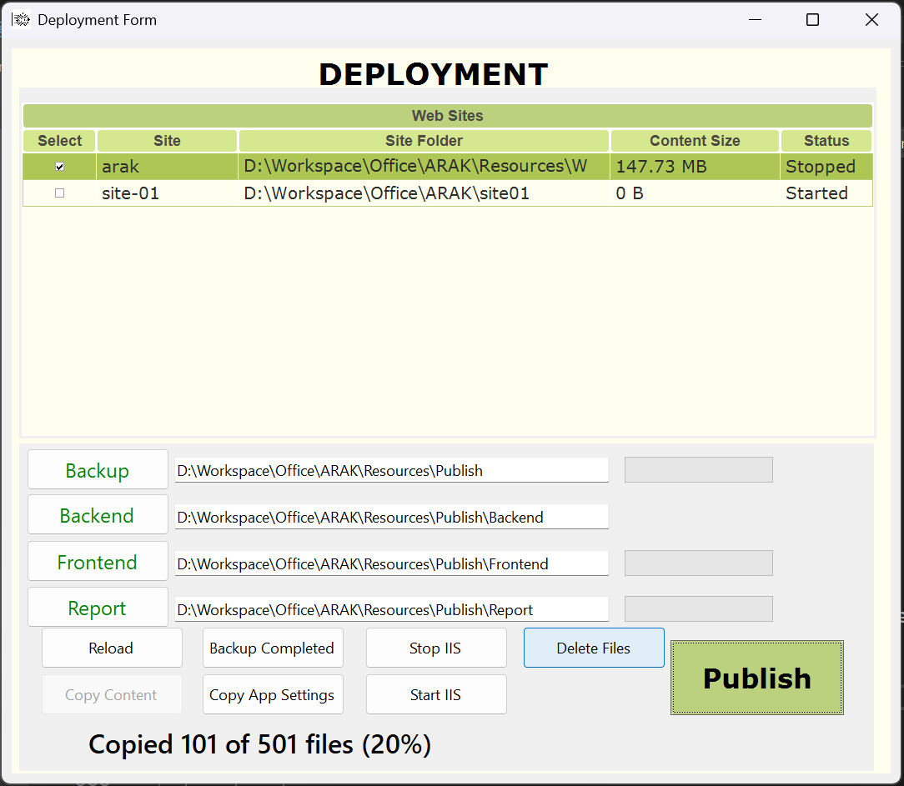
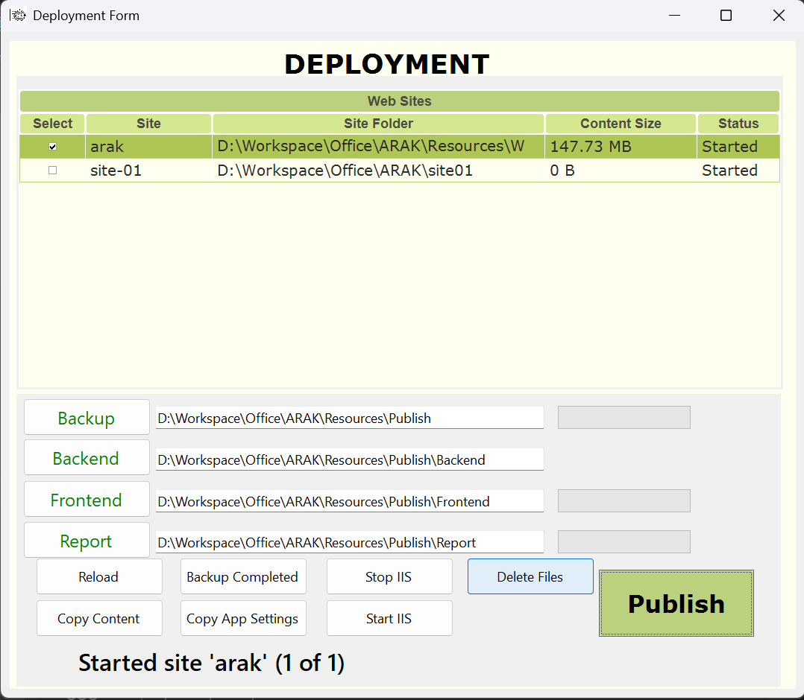

# Server Deployment Utility for IIS Web Applications

## Overview

This Windows Forms application streamlines deployment and management of IIS-hosted web applications, including backend APIs, Angular frontends, and ReportViewer web apps. It helps automate tasks such as site backup, stopping/starting IIS sites, file cleanup, and content publishing.

---

## Features

- **IIS Site Discovery:** Lists all IIS websites with status and physical paths.
- **Selective Site Management:** Choose one or more sites for backup and deployment.
- **Backup:** Backup entire site directories with progress reporting.
- **Stop/Start IIS Sites:** Control IIS sites via AppCmd commands.
- **Delete Site Files:** Safely delete files/folders while excluding critical folders (e.g., `Documents`).
- **Deploy Content:** Copy backend, frontend, and report files from source folders to target sites.
- **Configuration Sync:** Copy/update configuration files (`web.config`, `appsettings.json`) after deployment.
- **File/Folder Validation:** Validates backend, frontend, and report folders for expected files/folders before deployment.
- **Progress Reporting:** UI progress bars and colored status messages update in real-time.
- **Publish Button:** Executes the full deployment process (backup, stop site, delete files, deploy content, config sync, start site) as a single automated action.

---

## Deployment Form UI
 

  

<strong>Figure 1:</strong>  Initial Load with No Site Selected

  

<strong>Figure 2:</strong> Site Selected with Backup, Backend, Frontend, and Report Paths Set

  

<strong>Figure 3:</strong> Backup and Copy Progress Indicated with Percentage and File Count

  

<strong>Figure 4:</strong> Deployment Complete, Site Restarted and Running

**Note:** The **Publish** button triggers the entire deployment workflow, automating backup, site stopping, file cleanup, content deployment, configuration synchronization, and site restarting in one seamless process.

---
## Technology Stack

- .NET 8 Windows Forms
- Infragistics WinForms UltraGrid control
- PowerShell (to retrieve IIS site info)
- Windows AppCmd utility for IIS control
- JSON serialization with `System.Text.Json`

---

## Expected Folder Structures

### Backend Deployment Folder Must Contain
- `Documents/`, `runtimes/`
- Config files: `appsettings.json`, `web.config`, `efpt.config.json`, `libman.json`
- DLLs matching patterns `Microsoft.*.dll`, `System.*.dll`

### Frontend Angular Build Folder Must Contain
- `index.html`, `assets/`
- JS and CSS files matching dynamic regex patterns like `main.*.bundle.js`

### ReportViewer Folder Must Contain
- Directories like `bin`, `Content`, `fonts`, `Scripts`, `SqlServerTypes`
- Files such as `About.aspx`, `Default.aspx`, `ReportViewer.aspx`, `Site.Master`, etc.

---

## Usage

1. Launch the app with administrative privileges.
2. Select sites from the IIS list to backup/deploy.
3. Set backup destination and deployment source folders (backend, frontend, report).
4. Use buttons to perform backup, stop/start sites, delete files, copy configs, and deploy content.
5. Monitor status messages and progress bars for real-time feedback.

---

## How It Works

- Uses PowerShell to list IIS sites with name, physical path, and state.
- Uses Windows AppCmd to stop and start IIS sites.
- Recursively copies or deletes files and folders with UI progress updates.
- Validates expected file sets before deployment to avoid incomplete releases.

---

## Getting Started

- Clone or download the repository.
- Open in Visual Studio 2022+ and build the solution.
- Ensure you have the required `.NET SDK 8` and Infragistics(`InfragisticsUltimate2022.2`) controls installed.
- Ensure IIS is installed and configured on your machine.
- Ensure you have the necessary permissions to manage IIS sites.
- Ensure the required backend, frontend, and report folders are structured as expected.
- Ensure the `appsettings.json` and other config files are correctly set up in the backend folder.
- Ensure the Angular frontend is built and the output folder is ready for deployment.
- Ensure the ReportViewer web app files are in the correct structure.
- Ensure the `bin`, `Content`, `fonts`, `Scripts`, and `SqlServerTypes` folders are present in the ReportViewer folder.
- Ensure the `main.*.bundle.js` files are present in the Angular build folder.
- Ensure the `About.aspx`, `Default.aspx`, `ReportViewer.aspx`, and `Site.Master` files are present in the ReportViewer folder.
- Ensure the `appsettings.json`, `web.config`, and other config files are present in the backend deployment folder. 
- Run the executable as Administrator (required for IIS control).
- Configure the backup and deployment folders before publishing.
- Click the **Publish** button to execute the deployment workflow.
- Monitor the progress and status messages for feedback.
- After deployment, verify the sites are running correctly in IIS.
- Check the IIS Manager to confirm site status and content.
- Review the logs for any errors or warnings during deployment.

---

## Notes

- The tool is designed to work with IIS sites structured similarly to PetMatrix deployments.
- Administrative rights are required for IIS operations.
- The UI leverages Infragistics UltraGrid for a rich user experience.

---

## Author

Md Hasibul Islam Shanto  
LinkedIn: [bdshanto](https://www.linkedin.com/in/bdshanto)

---

## License

This project is licensed under the [MIT License](LICENSE).

